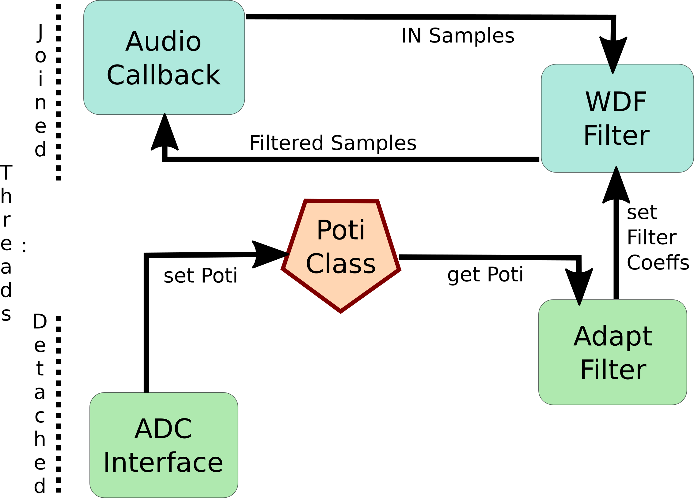

This repository is an example of how to implement a Wave Digital Filter (WDF) Tonestack on a Rasberry Pi 3.

# Packages
Make sure to fulfill all requirements of the WDF library first. This includes e.g. armadillo (and its dependencies) and superLU. Note that there are some multi-threaded drop-in replacements for the BLAS/LAPACK dependency available, e.g. OpenBLAS.

# A/D- Converter
An ADS1115 A/D-Converter provides 4 channels with 16 bit resolution and is connected to the PI via I2C.
You have to enable the PI's I2C port first.

Analog potentiometers can then modify the filter in real-time.

# Some Details
## Threads

Each rectangle symbolizes a basic thread. They can run joined, e.g. the Jack Audio Callback (Main) and the WDF filtering thread -- or completely independently (detached).

Since detached threads are not synchronized, a Poti Class stores the current Poti value and provides getters and setters for each Poti.

The Poti class is therefore only declared once. All other appearances use `extern`, so the linker uses the exact same instance all over.